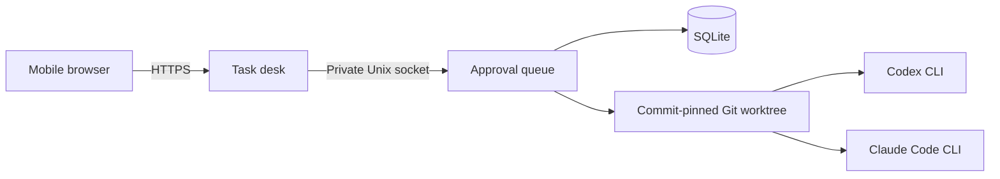

# Architecture

The daemon exposes health and metrics on loopback and a private Unix control socket. The HTTPS mobile gateway authenticates the user and forwards permitted operations to that socket. Projects map to local Git repositories; conversations group related turns within one project. Each turn remains a separately approved task. The serial runner stores task state in SQLite and spawns native agent processes.

## Lifecycle

`waiting_for_approval → queued → running → succeeded | failed | cancelled | timed_out | interrupted`

Cancellation briefly enters `cancelling`. A graceful shutdown interrupts active work. At startup, unfinished running records are marked interrupted. Approved queued work resumes automatically. Only one daemon may own a state directory.

`revision` is captured from the configured repository's HEAD at task creation. Uncommitted changes are not included. Each run gets a detached worktree. Artifacts and worktrees are retained; automatic retention is not implemented.

The runner and gateway currently share a Unix account. Worktrees isolate Git state, not permissions or credentials. Codex uses its read-only sandbox. Claude is restricted to Read, Glob and Grep tools. Neither restriction should be treated as a general hostile-code containment boundary.

## Interfaces

- `GET /healthz`, `/readyz`, `/v1/status`, `/metrics`: loopback daemon HTTP.
- Control socket: one newline-delimited JSON request; operations `create`, `list`, `show`, `approve`, `cancel`.
- Gateway: `/api/login`, `/api/logout`, `/api/tasks`, `/api/tasks/:id`, `/api/action`, `/api/upload`, `/api/images/:id`.

Socket replies are `{ok:true,result:...}` or `{ok:false,error:...}`. Create accepts `adapter`, `prompt`, optional `attachments` IDs and optional `parent` task ID. List returns the latest 100 tasks. Show includes events and a bounded log tail.

Images are copied into `.agentd-input/` in the task worktree. This creates untracked input files. A follow-up includes the immediate parent's instruction and a truncated log tail; it is not a resumed native session.

The adapter command selection currently lives in `src/runner.ts`. A stable plugin interface is a roadmap item.

## Project workspace

Projects and conversations are durable SQLite records. Legacy tasks migrate into Original workspace, preserving parent chains. Repository paths are selected by registered project ID. Browser project creation initializes an empty repository under `AGENTD_PROJECTS_DIR` (default: the state directory’s `projects` subdirectory). Arbitrary existing paths can only be registered through the private control socket. Existing repositories must have a commit.

A conversation allows one pending turn at a time. Follow-ups inherit the preceding task as context, but only the immediately preceding prompt and bounded output are passed to the agent. This is not an unlimited native conversation session. The interface shows the latest 30 turns and 100 conversations per project. Archiving hides a finished conversation without deleting records; restoration currently requires administration.
